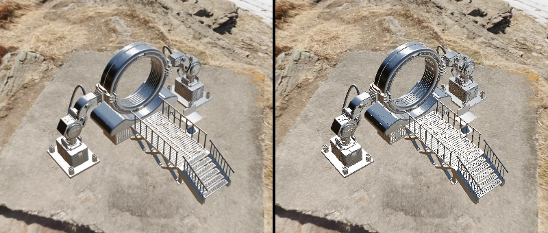

# TRAA

Implements Temporal Reprojection Anti-Aliasing in three.js.


Left: TRAA - Right: No AA

## Usage

Install the package first:

```
npm i traa
```

Then add it to your code like so:

```javascript
import { TRAAEffect } from "traa"

const composer = new POSTPROCESSING.EffectComposer(renderer)

const traaEffect = new TRAAEffect(scene, camera, options?)

const ssgiPass = new POSTPROCESSING.EffectPass(camera, traaEffect)

composer.addPass(traaEffect)
```

## Performance

### Default

When not moving the camera, TRAA performs better than MSAA and SMAA.
It is slightly behind FXAA and three.js' default anti-aliasing method regarding performance.
When moving the camera TRAA will still perform similar to MSAA.

## Resources

https://www.activision.com/cdn/research/Dynamic_Temporal_Antialiasing_and_Upsampling_in_Call_of_Duty_v4.pdf

## Credits

"Time Machine" (https://skfb.ly/ouAJU) by vertexmonster is licensed under Creative Commons Attribution (http://creativecommons.org/licenses/by/4.0/).
